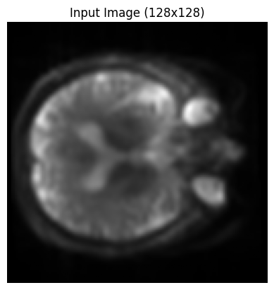
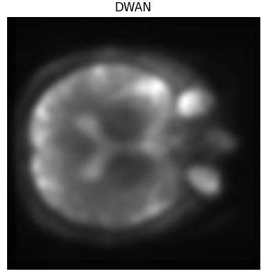

# 🧠 Denoising ASL Perfusion MRI with PyTorch

This project applies deep learning models to denoise Arterial Spin Labeling (ASL) perfusion MRI slices. Implemented in **PyTorch** and designed for **Google Colab**, it compares three models—**U-Net**, **DilatedNet**, and **DWAN**—on image quality enhancement using structural and signal-based metrics.

---

## 🚀 Key Features
- Input: `.nii` / `.nii.gz` ASL MRI files
- Models:
  - 🔹 U-Net
  - 🔹 DilatedNet
  - 🔹 DWAN
- Evaluation: PSNR, SSIM, CCC, MAE
- Runs on Google Colab – no setup required
- Visual results with zoomed patch comparisons

---

## 📥 Input & 📤 Outputs

| Original Input | U-Net Output | DilatedNet Output | DWAN Output |
|----------------|--------------|-------------------|-------------|
|  |  |  | |

---

### 🔍 Zoomed Patch Comparison

| Input (Zoomed) | U-Net (Zoomed) | DilatedNet (Zoomed) | DWAN (Zoomed) |
|----------------|----------------|----------------------|----------------|
|  |

---

## 📊 Sample Metrics

| Model       | PSNR   | SSIM   | CCC    | MAE     |
|-------------|--------|--------|--------|---------|
| U-Net       | 33.50  | 0.7692 | 0.9947 | 0.0163  |
| DilatedNet  | 35.72  | 0.9189 | 0.9963 | 0.0119  |
| DWAN        | 30.38  | 0.8769 | 0.9871 | 0.0196  |

---

## 🛠️ Quick Start

1. Open `main_notebook.ipynb` in Google Colab
2. Upload your `.nii` or `.nii.gz` file
3. Choose a model and train it (100 epochs default)
4. View the results with visual and metric evaluation

---

## ⚙️ Requirements

```bash
pip install torch torchvision
pip install nibabel matplotlib scikit-image scipy
